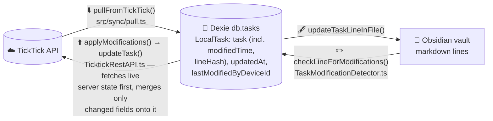
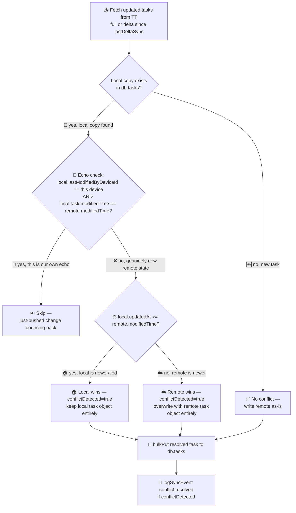
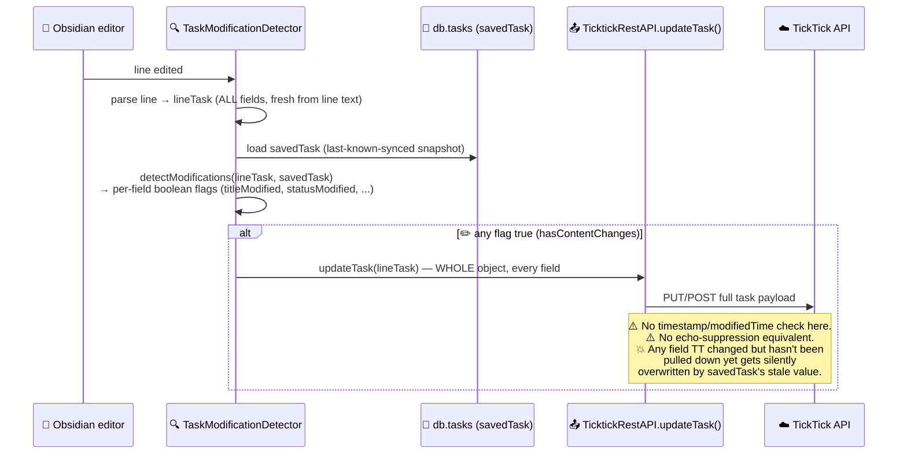
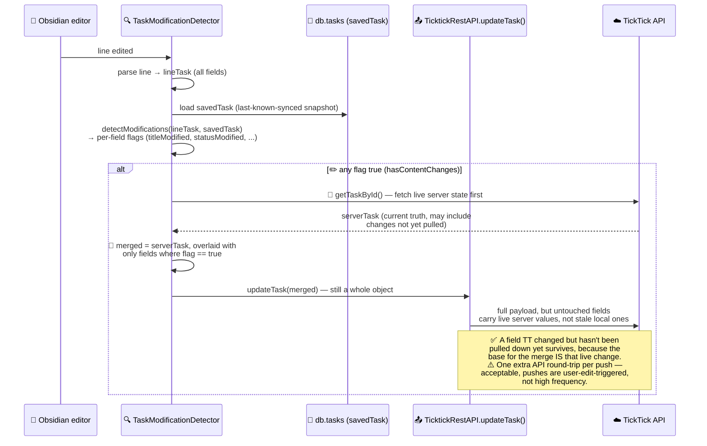
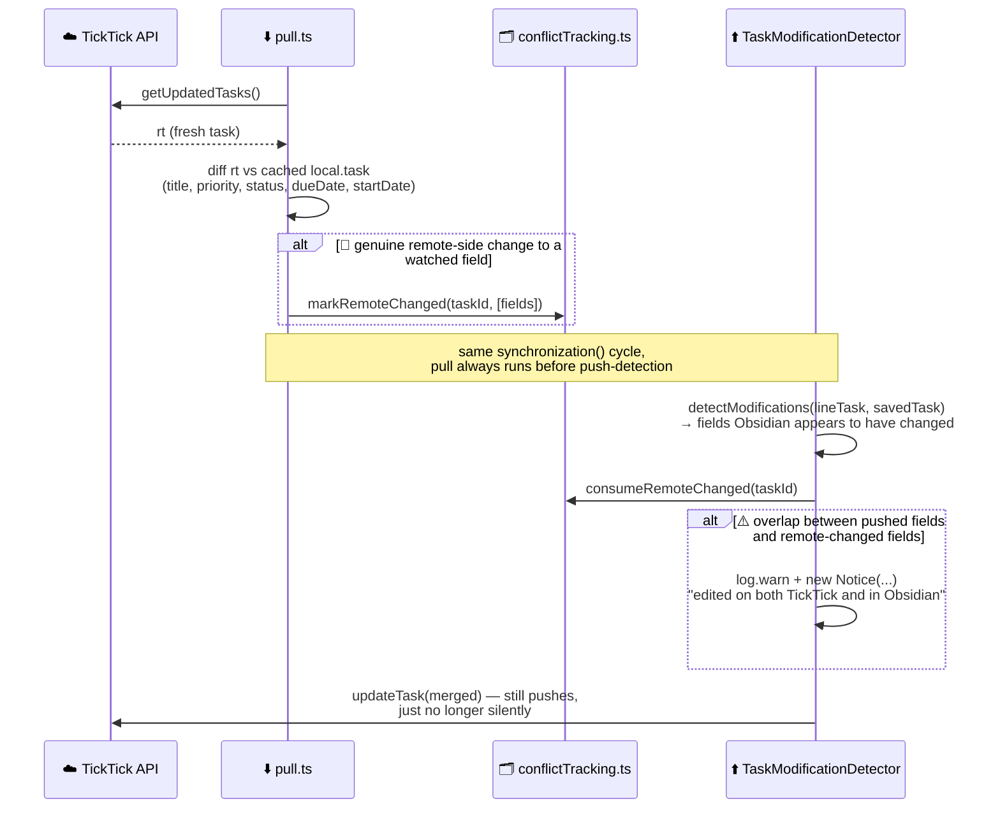

# Sync Logic: Conflict Resolution & Corner Cases

Internal developer/contributor doc — not part of the published mkdocs
site (`docs-src/`). Describes how this plugin currently decides which
side wins when TickTick and Obsidian both have a copy of a task, and the
corner cases that fall out of that.

**Scope note:** this covers *task field* sync (status, title, dates,
priority, tags, notes, parent). Deletion handling and file/folder
routing are separate subsystems (`TaskDeletionHandler.ts`,
`FolderSyncService.ts`) and are only mentioned here where they intersect
with conflict resolution.

## The two independent paths

There is no single "sync engine" — pull (TickTick → local) and push
(Obsidian edit → TickTick) are two separate code paths that both read
and write the same Dexie `db.tasks` table, but make very different
decisions about whose data wins.

## When does each path run?

Pull only ever runs as part of a full `synchronization()` cycle
(interval-based, or a manual "sync now"). Push has two distinct
triggers, registered in `src/services/EventHandlerService.ts`:

- **⚡ Eager, single-line push** — fires when the cursor leaves a line
  you just edited (`editor-change`, ~1s debounce) →
  `lineModifiedTaskCheck` → `checkLineForModifications` directly, on
  just that one file/line. **No pull step at all.** This is the common
  case for a normal edit-and-move-on, and by itself is safe from the
  pull-side clobbering described below, since the merge-onto-live-state
  fix (below) fetches fresh server state right at push time regardless.
- **🔁 Periodic/manual full sync** — `synchronization()`: pull → vault
  rewrite from whatever pull resolved → push-detection over every
  tracked file, always in that order. An edit still "in flight" (cursor
  still on the line, or the 1s debounce hasn't elapsed yet) when this
  fires instead of the eager path is the one case where pull's
  whole-line vault rewrite can run before the local edit was ever
  detected — see the 🏃 corner case below.

⚠️ If **Full Vault Sync** (`enableFullVaultSync`, off by default) is
turned on, the eager per-keystroke handler is skipped entirely — see
`EventHandlerService.ts` line ~112 — so *every* edit relies solely on
the periodic cycle to get pushed, making the 🏃 race below the normal
case instead of a narrow one. That setting's actual purpose is scope
(sync every task in the vault, not just `#ticktick`-tagged ones,
auto-tagging as it goes — see `docs-src/configuration/sync-control.md`
§ Full Vault Sync); the eager-push skip is a perf/safety side effect of
that scope change, not something anyone is opting into on purpose.

## Pull path: whole-task, timestamp last-write-wins

`src/sync/pull.ts` (`pullFromTickTick`), decision logic lives in
`src/sync/conflicts.ts` (`resolveTaskConflict`).

Key properties:
- **Whole-task granularity.** The winner's *entire* task object replaces
  the loser's — this is not a per-field merge. If local wins, none of
  remote's changes (even to fields local didn't touch) survive this
  pull.
- **Echo suppression** exists specifically so a device doesn't
  immediately re-pull-and-conflict against the change it just pushed
  itself, before TT's `modifiedTime` has had a chance to diverge.
- Deletions are handled separately (below the conflict-resolution block
  in `pull.ts`) — a TT-reported deletion just sets `local.deleted = true`
  unconditionally, no conflict check against local edits.
- `lastFullSync` / `lastDeltaSync` checkpoints gate whether the *next*
  pull is a full or incremental fetch — doesn't affect per-task conflict
  logic, only which tasks get considered.

## Push path: field-diff triggered, merges onto live server state

`src/services/TaskModificationDetector.ts` (`checkLineForModifications`
→ `detectModifications` → `applyModifications`), API call in
`src/services/TicktickRestAPI.ts` (`updateTask`).

### Original behavior (fixed 2026-07-29)

Before the fix below, the push simply sent `lineTask` — the whole
object, freshly parsed from the vault line — straight to `updateTask()`,
with no staleness check of any kind:

This was the confirmed root cause of two live incidents (2026-07-27/28,
David's account): a task completed on mobile got silently reverted, and
a task's priority got silently reverted — both because an unrelated
field edit (or a routine resync) triggered a full-object push that
carried a stale `status`/`priority` value along for the ride, clobbering
a TT-side change the plugin hadn't pulled down yet. Fixed by the merge
below — this is history, not current behavior.

### 🎯 Merge onto live server state (current behavior)

Scoped to the push path only. **Not a partial/omitted-fields payload —
that approach is broken here.** `src/api/index.ts` `Tick.updateTask()`
(the wrapper `TicktickRestAPI.updateTask()` calls) builds its outgoing
object field-by-field as `jsonOptions.field ? val : HARDCODED_DEFAULT`
— an *omitted* field isn't left alone, it's reset to a blank default
(`status: 0`, `priority: 0`, `tags: []`, `parentId: null`, ...) before
the request is even sent. Omitting untouched fields would make the
clobbering worse, not better.

Instead: fetch the current server task fresh (`getTaskById`) immediately
before pushing, then merge only the fields `detectModifications`
flagged as changed from `lineTask` onto that live server state, and
send the merged *whole* object. This still satisfies the wrapper's
full-object construction, but every untouched field reflects true
current TT state instead of a stale local (`savedTask`) snapshot.

**What this closes:** the 💥 row in the corner-cases table below — an
unrelated field edit can no longer clobber a stale field.

**Same fix applied a second place:** `TicktickRestAPI.moveTaskProject()`
has its own follow-up `updateTask()` call (a project-move triggers a
second, "redundant but TickTick does it" whole-object push) that had
the identical bug — sending the raw, unmerged task. Fixed the same way:
fetch live server state, override only `projectId`, send that merged.

**What this does NOT close** (deliberately out of scope): true general
per-field conflict *resolution* (deciding a winner by timestamp, or a
user-facing resolution prompt) for the ⚖️ same-field-both-sides race
below. Instead of resolving it silently, that case is now **detected
and surfaced** — see the next section.

### ⚠️ Simultaneous-edit detection (same-field-both-sides)

The 💥 fix above only protects *untouched* fields during a push. It
doesn't help when the field Obsidian is about to push is the *same*
field TickTick independently changed — that's a genuine collision, not
staleness, and there's no "right" answer to silently pick. Silently
preferring Obsidian (which is what a naive push would do, since
`detectModifications` can't tell "user edited this" from "TickTick
changed this and Obsidian just hasn't caught up yet") is exactly the
failure mode observed live: title/priority edited on TickTick got
reverted by the next Obsidian-triggered sync.

`src/sync/pull.ts` already knows, at pull time, whether a field
genuinely changed on TickTick's side since the last sync (comparing the
previous cached task to the freshly-fetched one, same signal echo
suppression uses). `src/sync/conflictTracking.ts` is a small in-memory,
per-sync-cycle map that carries that fact forward from the pull step to
the push step (`TaskModificationDetector.applyModifications`), which
runs moments later in the same `synchronization()` cycle. If a field
about to be pushed was also flagged as remote-changed this cycle, the
plugin still pushes (no winner-picking logic — see above) but logs a
warning and raises an Obsidian `Notice` naming the task and the
colliding field(s), so the user knows to go check TickTick rather than
silently losing the edit.

This also fixed a smaller, related correctness bug found while building
it: `pull.ts` was dropping the local change-detection hash (`lineHash`)
whenever TickTick won a pull conflict, since the raw API response never
carries one. That's usually papered over moments later when the vault
line gets rewritten to match, but on any path where that rewrite
doesn't happen, the next push-detection cycle saw a spurious hash
mismatch with zero real edit involved, and silently re-stamped the
task's `updatedAt` to "now" for no reason — which can itself poison
future pull-side timestamp comparisons. `pull.ts` now carries the old
`lineHash` forward across a pull.

**Coverage gap: this warning only fires during a full `synchronization()`
cycle.** `markRemoteChanged`/`consumeRemoteChanged` only ever get
populated by `pull.ts` — see "When does each path run?" above. The
common case, an eager single-line push, never runs pull at all, so a
same-field collision resolved entirely within one pushes silently, same
as before this fix: no warning, no detection. The merge-onto-live-state
fix above still protects it from clobbering *other* fields (fresh state
fetched right at push time regardless), but if the *same* field
collided, Obsidian's edit still silently wins with no Notice.

## Corner cases (current behavior)

| Case | What happens today |
|---|---|
| ✅ Same device re-pulls its own just-pushed change | Echo-suppressed on pull (skipped) — works correctly. |
| ✅ TT-side field change not yet pulled, unrelated field edited locally | Fixed — push merges onto live server state, see above. |
| ⚠️ Local edit and remote edit to the *same* field, both surviving into one *full sync cycle* (pull ran) | **Detected, not resolved.** Still pushes Obsidian's value (no winner-picking logic), but logs + shows a `Notice` naming the task and field so the user can check TickTick. See "Simultaneous-edit detection" above. |
| 🏃 Local edit still "in flight" (cursor on the line, or the ~1s debounce hasn't fired) exactly when a periodic full sync runs, on a task TT also changed | **Not handled.** Pull's whole-line vault rewrite (see "When does each path run?") can overwrite the not-yet-detected edit before push-detection ever sees it — no merge, no warning. Narrow by default (eager push almost always wins the race); the normal case, not narrow, if `enableFullVaultSync` is on. |
| ⚠️ Same-field collision resolved entirely within an eager single-line push (no pull involved) | **Not detected.** The Simultaneous-edit `Notice` only fires when `pull.ts` ran in the same cycle. Obsidian's value silently wins, same as before that fix — see "Coverage gap" above. |
| 🗑️ TT reports a task deleted | Local `deleted` flag set unconditionally, no check against pending local edits to that task. |
| 🔄 Full vs. delta sync | Only affects which tasks are considered for pull, not the conflict-resolution decision itself. |
