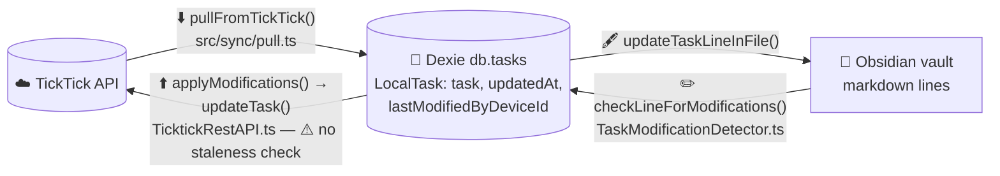
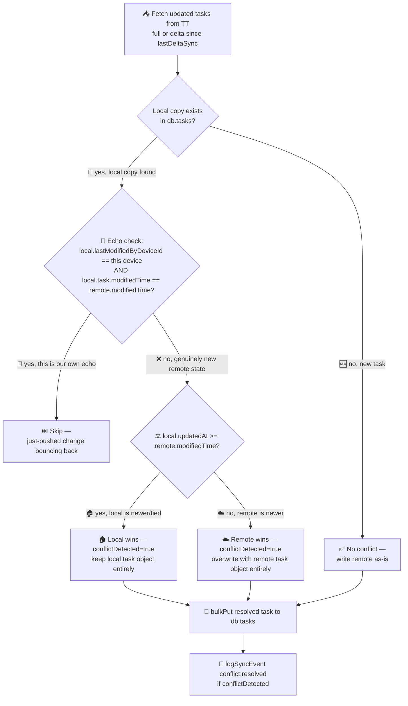
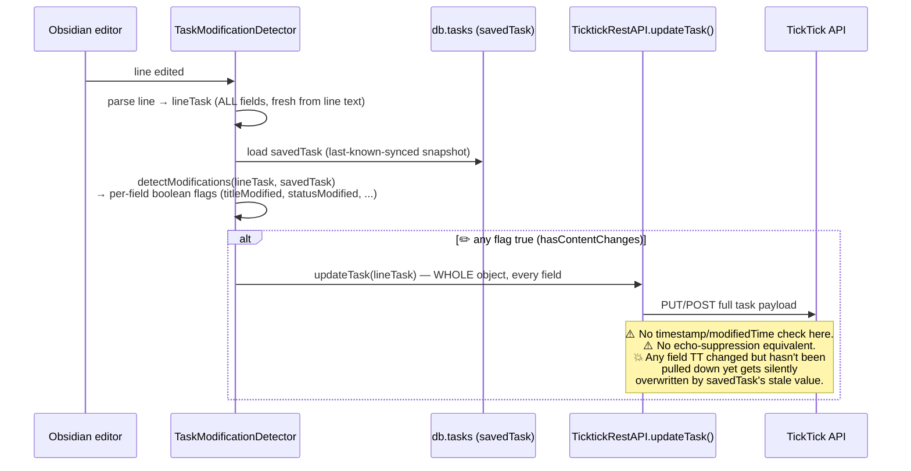

# Sync Logic: Conflict Resolution & Corner Cases

Internal developer/contributor doc — not part of the published mkdocs
site (`docs-src/`). Describes how this plugin currently decides which
side wins when TickTick and Obsidian both have a copy of a task, and the
corner cases that fall out of that.

**Scope note:** this covers *task field* sync (status, title, dates,
priority, tags, notes, parent). Deletion handling and file/folder
routing are separate subsystems (`TaskDeletionHandler.ts`,
`FolderSyncService.ts`) and are only mentioned here where they intersect
with conflict resolution.

## The two independent paths

There is no single "sync engine" — pull (TickTick → local) and push
(Obsidian edit → TickTick) are two separate code paths that both read
and write the same Dexie `db.tasks` table, but make very different
decisions about whose data wins.

## Pull path: whole-task, timestamp last-write-wins

`src/sync/pull.ts` (`pullFromTickTick`), decision logic lives in
`src/sync/conflicts.ts` (`resolveTaskConflict`).

Key properties:
- **Whole-task granularity.** The winner's *entire* task object replaces
  the loser's — this is not a per-field merge. If local wins, none of
  remote's changes (even to fields local didn't touch) survive this
  pull.
- **Echo suppression** exists specifically so a device doesn't
  immediately re-pull-and-conflict against the change it just pushed
  itself, before TT's `modifiedTime` has had a chance to diverge.
- Deletions are handled separately (below the conflict-resolution block
  in `pull.ts`) — a TT-reported deletion just sets `local.deleted = true`
  unconditionally, no conflict check against local edits.
- `lastFullSync` / `lastDeltaSync` checkpoints gate whether the *next*
  pull is a full or incremental fetch — doesn't affect per-task conflict
  logic, only which tasks get considered.

## Push path: field-diff triggered, no staleness check (current gap)

`src/services/TaskModificationDetector.ts` (`checkLineForModifications`
→ `detectModifications` → `applyModifications`), API call in
`src/services/TicktickRestAPI.ts` (`updateTask`).

This is the confirmed root cause of two live incidents (2026-07-27/28,
David's account): a task completed on mobile got silently reverted, and
a task's priority got silently reverted — both because an unrelated
field edit (or a routine resync) triggered a full-object push that
carried a stale `status`/`priority` value along for the ride, clobbering
a TT-side change the plugin hadn't pulled down yet.

## Corner cases (current behavior)

| Case | What happens today |
|---|---|
| ✅ Same device re-pulls its own just-pushed change | Echo-suppressed on pull (skipped) — works correctly. |
| 💥 TT-side field change not yet pulled, unrelated field edited locally | **Not handled.** Push sends the whole `lineTask`, silently overwriting the un-pulled TT change. See "Target fix" under the push-path section above. |
| ⚖️ Local edit and remote edit to the *same* field, both within one sync interval | Pull's LWW resolves it by `updatedAt`/`modifiedTime` comparison — correct in the sense that "most recent wins", but still whole-task granularity, so an unrelated field on the losing side can be lost too. |
| 🗑️ TT reports a task deleted | Local `deleted` flag set unconditionally, no check against pending local edits to that task. |
| 🔄 Full vs. delta sync | Only affects which tasks are considered for pull, not the conflict-resolution decision itself. |
